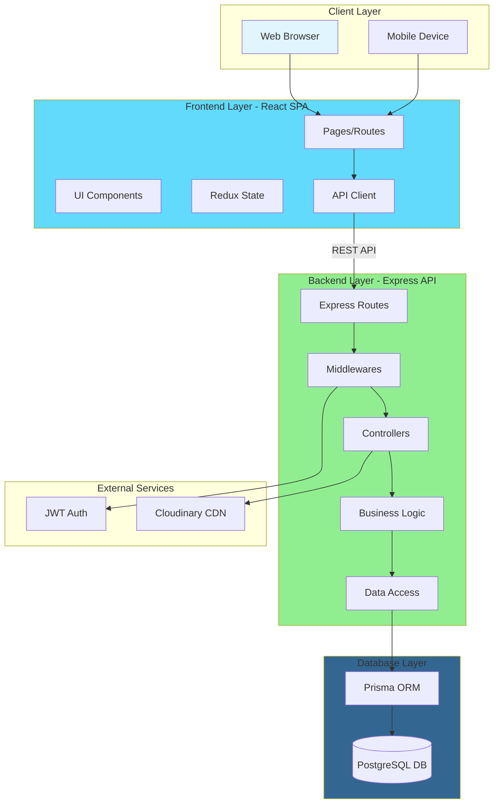
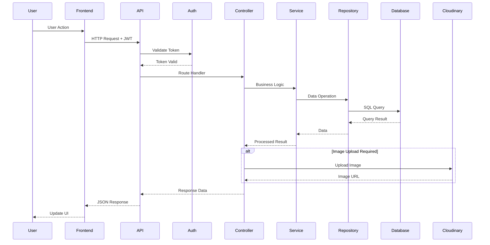
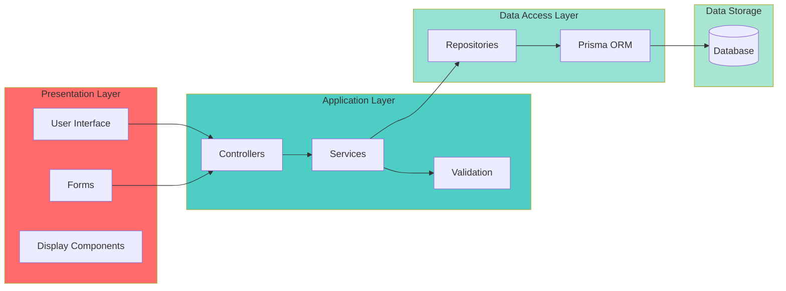

# TEMBERA Project Diagrams Summary

## Available Diagrams

This document provides an overview of all project diagrams created for the TEMBERA Tourism Platform.

### 1. Use Case Diagram
**File**: `diagrams/use-case-diagram.md`

Shows the interactions between different system actors and use cases:
- **Actors**: Visitor, User/Tourist, Company Owner, Administrator
- **Use Cases**: 30+ use cases covering browsing, booking, company management, and administration
- Includes use case descriptions and relationships

### 2. Entity-Relationship Diagram (ERD)
**File**: `diagrams/erd-diagram.md`

Depicts the database schema with all entities and relationships:
- **Entities**: User, Role, Company, Itinerary, ItineraryImage, Booking, BookingItem, BookingMember
- Shows cardinality and relationships between tables
- Includes detailed entity descriptions with attributes and constraints

### 3. Class Diagram
**File**: `diagrams/class-diagram.md`

Illustrates the object-oriented structure of the backend system:
- **Controllers**: AuthController, UserController, CompanyController, ItineraryController, BookingController
- **Services**: UserService, CompanyService, ItineraryService, BookingService
- **Repositories**: UserRepository, CompanyRepository, ItineraryRepository, BookingRepository
- **Models**: User, Role, Company, Itinerary, Booking entities
- Shows relationships and design patterns used

## Additional Diagrams to Create

### 4. System Architecture Diagram

**Mermaid Diagram**:

**Components:**
- **Client Layer**: Web and mobile browsers
- **Frontend**: React SPA with Redux state management
- **Backend**: Express.js RESTful API with layered architecture
- **External Services**: Cloudinary for images, JWT for authentication
- **Database**: PostgreSQL with Prisma ORM

### 5. Proposed Model Diagram

**Request-Response Flow**:

**Layered Architecture Model**:

## Quick Reference

| Diagram Type | Purpose | Key Elements |
|--------------|---------|--------------|
| Use Case | User interactions | Actors, Use Cases, Relationships |
| ERD | Database design | Tables, Columns, Foreign Keys |
| Class | Code structure | Classes, Methods, Relationships |
| Architecture | System overview | Layers, Components, Data Flow |
| Model | Process flows | Sequences, Workflows, Patterns |

## How to View Diagrams

1. **GitHub**: Diagrams render automatically in markdown files
2. **Mermaid Live Editor**: Copy mermaid code to https://mermaid.live
3. **VS Code**: Install "Markdown Preview Mermaid Support" extension
4. **IDE**: Most modern IDEs support Mermaid rendering

## Diagram Standards

All diagrams follow these standards:
- **Format**: Mermaid syntax in markdown files
- **Style**: Consistent color schemes and naming conventions
- **Documentation**: Each diagram includes descriptions and legends
- **Version Control**: All diagrams are versioned with the codebase

---

**Last Updated**: March 29, 2026  
**Maintained By**: Team 3

