# Class Diagram - TEMBERA Tourism Platform

## Backend Class Diagram (Mermaid)

```mermaid
classDiagram
    %% Controllers Layer
    class AuthController {
        -userRepository: UserRepository
        +register(req: Request, res: Response)
        +login(req: Request, res: Response)
    }
    
    class UserController {
        -userService: UserService
        +getAllUsers(req: Request, res: Response)
        +getUserById(req: Request, res: Response)
        +updateUser(req: Request, res: Response)
        +deleteUser(req: Request, res: Response)
        +getUserRoles(req: Request, res: Response)
        +createRole(req: Request, res: Response)
    }
    
    class CompanyController {
        -companyService: CompanyService
        +getAllCompanies(req: Request, res: Response)
        +getCompanyById(req: Request, res: Response)
        +createCompany(req: Request, res: Response)
        +updateCompany(req: Request, res: Response)
        +deleteCompany(req: Request, res: Response)
        +getCompanyStatistics(req: Request, res: Response)
    }
    
    class ItineraryController {
        -itineraryService: ItineraryService
        +getAllItineraries(req: Request, res: Response)
        +getItineraryById(req: Request, res: Response)
        +createItinerary(req: Request, res: Response)
        +updateItinerary(req: Request, res: Response)
        +deleteItinerary(req: Request, res: Response)
        +uploadImages(req: Request, res: Response)
    }
    
    class BookingController {
        -bookingService: BookingService
        +getAllBookings(req: Request, res: Response)
        +getBookingById(req: Request, res: Response)
        +createBooking(req: Request, res: Response)
        +updateBooking(req: Request, res: Response)
        +cancelBooking(req: Request, res: Response)
        +getMyBookings(req: Request, res: Response)
        +getCompanyBookings(req: Request, res: Response)
    }
    
    class UploadController {
        +uploadImage(req: Request, res: Response)
        -cloudinaryUpload(file: File)
    }
    
    %% Services Layer
    class UserService {
        -userRepository: UserRepository
        -roleRepository: RoleRepository
        +createUser(data: CreateUserDTO)
        +getUserById(id: string)
        +getAllUsers()
        +updateUser(id: string, data: UpdateUserDTO)
        +deleteUser(id: string)
        +assignRole(userId: string, role: string)
        +getUserRoles(userId: string)
    }
    
    class CompanyService {
        -companyRepository: CompanyRepository
        -userRepository: UserRepository
        +createCompany(data: CreateCompanyDTO)
        +getCompanyById(id: string)
        +getAllCompanies()
        +updateCompany(id: string, data: UpdateCompanyDTO)
        +deleteCompany(id: string)
        +getCompanyByOwnerId(ownerId: string)
        +getStatistics(companyId: string)
    }
    
    class ItineraryService {
        -itineraryRepository: ItineraryRepository
        -companyRepository: CompanyRepository
        +createItinerary(data: CreateItineraryDTO)
        +getItineraryById(id: string)
        +getAllItineraries(filters: FilterDTO)
        +updateItinerary(id: string, data: UpdateItineraryDTO)
        +deleteItinerary(id: string)
        +addImages(itineraryId: string, images: ImageDTO[])
        +getCompanyItineraries(companyId: string)
    }
    
    class BookingService {
        -bookingRepository: BookingRepository
        -itineraryRepository: ItineraryRepository
        +createBooking(data: CreateBookingDTO)
        +getBookingById(id: string)
        +getAllBookings()
        +updateBooking(id: string, data: UpdateBookingDTO)
        +cancelBooking(id: string)
        +getUserBookings(userId: string)
        +getCompanyBookings(companyId: string)
        +addBookingMembers(bookingId: string, members: MemberDTO[])
    }
    
    %% Repository Layer
    class UserRepository {
        -prisma: PrismaClient
        +create(data: UserData)
        +findById(id: string)
        +findByEmail(email: string)
        +findAll()
        +update(id: string, data: UserData)
        +delete(id: string)
        +findWithRolesByEmail(email: string)
    }
    
    class RoleRepository {
        -prisma: PrismaClient
        +create(data: RoleData)
        +findByUserId(userId: string)
        +update(id: string, data: RoleData)
        +delete(id: string)
    }
    
    class CompanyRepository {
        -prisma: PrismaClient
        +create(data: CompanyData)
        +findById(id: string)
        +findAll()
        +update(id: string, data: CompanyData)
        +delete(id: string)
        +findByOwnerId(ownerId: string)
    }
    
    class ItineraryRepository {
        -prisma: PrismaClient
        +create(data: ItineraryData)
        +findById(id: string)
        +findAll(filters: Filters)
        +update(id: string, data: ItineraryData)
        +delete(id: string)
        +findByCompanyId(companyId: string)
    }
    
    class BookingRepository {
        -prisma: PrismaClient
        +create(data: BookingData)
        +findById(id: string)
        +findAll()
        +update(id: string, data: BookingData)
        +delete(id: string)
        +findByUserId(userId: string)
        +findByItineraryId(itineraryId: string)
    }
    
    %% Models/Entities
    class User {
        +id: string
        +name: string
        +email: string
        +phone_number: string
        +password: string
        +roles: Role[]
        +bookings: Booking[]
        +companies: Company[]
    }
    
    class Role {
        +id: string
        +user_id: string
        +access_level: string
        +access_status: string
        +user: User
    }
    
    class Company {
        +id: string
        +name: string
        +description: string
        +contact: string
        +owner_id: string
        +owner: User
        +itineraries: Itinerary[]
    }
    
    class Itinerary {
        +id: string
        +company_id: string
        +title: string
        +activity: string
        +description: string
        +location: string
        +date: Date
        +price: number
        +company: Company
        +bookings: Booking[]
        +images: ItineraryImage[]
        +items: BookingItem[]
    }
    
    class ItineraryImage {
        +id: string
        +itinerary_id: string
        +image_path: string
        +image_url: string
        +public_id: string
        +order: number
        +created_at: Date
        +itinerary: Itinerary
    }
    
    class Booking {
        +id: string
        +user_id: string
        +itinerary_id: string
        +status: string
        +date: Date
        +description: string
        +type: string
        +user: User
        +itinerary: Itinerary
        +items: BookingItem[]
        +members: BookingMember[]
    }
    
    class BookingItem {
        +id: string
        +booking_id: string
        +itinerary_id: string
        +booking: Booking
        +itinerary: Itinerary
    }
    
    class BookingMember {
        +id: string
        +booking_id: string
        +name: string
        +email: string
        +phone: string
        +booking: Booking
    }
    
    %% Middleware
    class AuthMiddleware {
        +authenticateToken(req, res, next)
        +authorizeRole(roles: string[])
        -verifyJWT(token: string)
    }
    
    class UploadMiddleware {
        +multerConfig: MulterOptions
        +upload: Multer
        +handleUpload(req, res, next)
    }
    
    %% Utilities
    class ResponseHandler {
        +success(res, status, message, data)
        +error(res, status, message)
    }
    
    class HTTPError {
        <<abstract>>
        +statusCode: number
        +message: string
    }
    
    class NotFoundError {
        +statusCode: 404
    }
    
    class UnauthorizedError {
        +statusCode: 401
    }
    
    class BadRequestError {
        +statusCode: 400
    }
    
    class ConflictError {
        +statusCode: 409
    }
    
    class Logger {
        +info(message: string)
        +error(message: string, error: Error)
        +warn(message: string)
        +debug(message: string)
    }
    
    %% Relationships - Controllers to Services
    AuthController --> UserRepository
    UserController --> UserService
    CompanyController --> CompanyService
    ItineraryController --> ItineraryService
    BookingController --> BookingService
    
    %% Services to Repositories
    UserService --> UserRepository
    UserService --> RoleRepository
    CompanyService --> CompanyRepository
    CompanyService --> UserRepository
    ItineraryService --> ItineraryRepository
    ItineraryService --> CompanyRepository
    BookingService --> BookingRepository
    BookingService --> ItineraryRepository
    
    %% Repositories to Models
    UserRepository --> User
    RoleRepository --> Role
    CompanyRepository --> Company
    ItineraryRepository --> Itinerary
    BookingRepository --> Booking
    
    %% Model Relationships
    User "1" --> "0..*" Role
    User "1" --> "0..*" Company
    User "1" --> "0..*" Booking
    Company "1" --> "0..*" Itinerary
    Itinerary "1" --> "0..*" Booking
    Itinerary "1" --> "0..*" ItineraryImage
    Itinerary "1" --> "0..*" BookingItem
    Booking "1" --> "0..*" BookingItem
    Booking "1" --> "0..*" BookingMember
    
    %% Middleware Usage
    AuthMiddleware ..> UserRepository
    AuthMiddleware ..> ResponseHandler
    
    %% Error Hierarchy
    HTTPError <|-- NotFoundError
    HTTPError <|-- UnauthorizedError
    HTTPError <|-- BadRequestError
    HTTPError <|-- ConflictError
    
    %% Utility Usage
    AuthController ..> ResponseHandler
    UserController ..> ResponseHandler
    CompanyController ..> ResponseHandler
    ItineraryController ..> ResponseHandler
    BookingController ..> ResponseHandler
```

## Class Descriptions

### Controllers Layer
Controllers handle HTTP requests, validate input, call appropriate services, and return responses.

- **AuthController**: Handles user registration and authentication
- **UserController**: Manages user CRUD operations
- **CompanyController**: Manages company operations
- **ItineraryController**: Handles itinerary management
- **BookingController**: Manages booking operations
- **UploadController**: Handles file uploads to Cloudinary

### Services Layer
Services contain business logic and orchestrate repository calls.

- **UserService**: User-related business logic
- **CompanyService**: Company management logic
- **ItineraryService**: Itinerary operations and validation
- **BookingService**: Booking workflow and rules

### Repository Layer
Repositories handle database operations using Prisma ORM.

- **UserRepository**: User data access
- **RoleRepository**: Role management data access
- **CompanyRepository**: Company data operations
- **ItineraryRepository**: Itinerary database operations
- **BookingRepository**: Booking data access

### Models/Entities
Domain models representing database tables.

- **User**: User account information
- **Role**: User role and access level
- **Company**: Tour company details
- **Itinerary**: Travel package information
- **ItineraryImage**: Images associated with itineraries
- **Booking**: Booking transaction records
- **BookingItem**: Junction table for booking-itinerary relationship
- **BookingMember**: Group booking member information

### Middleware
- **AuthMiddleware**: JWT authentication and authorization
- **UploadMiddleware**: File upload handling with Multer

### Utilities
- **ResponseHandler**: Standardized API response formatting
- **HTTPError**: Custom error classes for different HTTP status codes
- **Logger**: Winston-based logging utility

## Design Patterns Used

1. **Layered Architecture**: Clear separation of concerns (Controllers → Services → Repositories)
2. **Repository Pattern**: Abstracts data access logic
3. **Dependency Injection**: Services and repositories injected into controllers
4. **Singleton Pattern**: Single Prisma client instance
5. **Factory Pattern**: Error creation with custom error classes
6. **Middleware Pattern**: Express middleware for cross-cutting concerns
7. **DTO Pattern**: Data Transfer Objects for API contracts

## Key Principles

- **Single Responsibility**: Each class has one clear purpose
- **Open/Closed**: Classes open for extension, closed for modification
- **Dependency Inversion**: Depend on abstractions, not concrete implementations
- **Interface Segregation**: Focused repository interfaces
- **DRY**: Reusable utilities and response handlers

---

**Framework**: Express.js + TypeScript  
**ORM**: Prisma  
**Architecture**: Layered/Clean Architecture  
**Last Updated**: March 29, 2026

