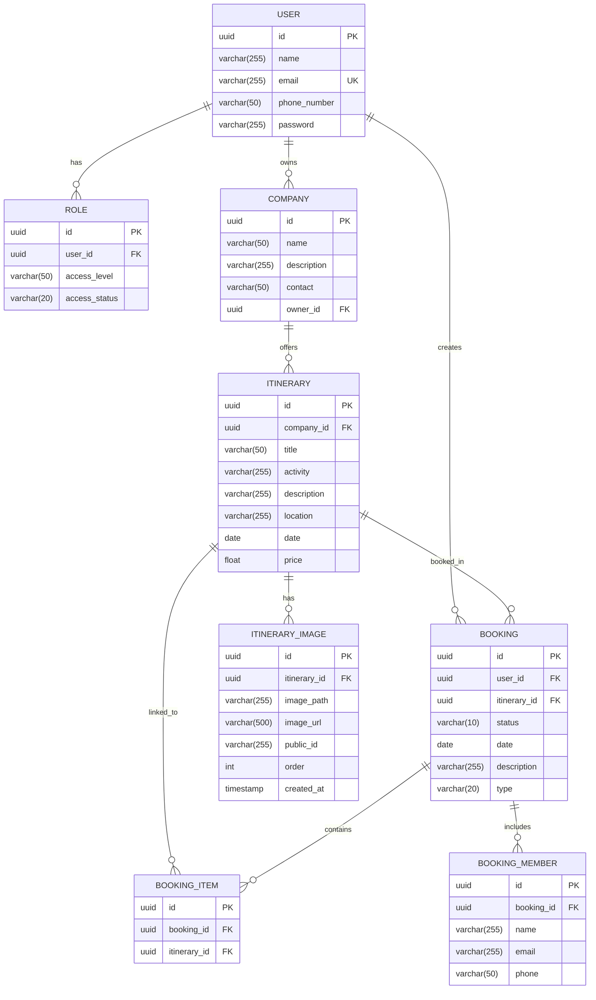

# Entity-Relationship Diagram (ERD) - TEMBERA Database

## Database Schema ERD (Mermaid)



## Detailed Entity Descriptions

### USER Entity
Stores information about all users in the system (tourists, company owners, admins).

| Attribute | Type | Constraints | Description |
|-----------|------|-------------|-------------|
| id | UUID | PRIMARY KEY | Unique user identifier |
| name | VARCHAR(255) | NOT NULL | User's full name |
| email | VARCHAR(255) | NOT NULL, UNIQUE | User's email address (login credential) |
| phone_number | VARCHAR(50) | NULL | Contact phone number |
| password | VARCHAR(255) | NOT NULL | Bcrypt hashed password |

### ROLE Entity
Manages user roles and access levels in the system.

| Attribute | Type | Constraints | Description |
|-----------|------|-------------|-------------|
| id | UUID | PRIMARY KEY | Unique role identifier |
| user_id | UUID | FOREIGN KEY | Reference to USER |
| access_level | VARCHAR(50) | NOT NULL | Role type: admin, company, user, visitor |
| access_status | VARCHAR(20) | NOT NULL | Status: active, inactive |

**Constraints:**
- UNIQUE constraint on (user_id, access_level) - prevents duplicate roles

### COMPANY Entity
Stores information about tour companies registered on the platform.

| Attribute | Type | Constraints | Description |
|-----------|------|-------------|-------------|
| id | UUID | PRIMARY KEY | Unique company identifier |
| name | VARCHAR(50) | NOT NULL | Company name |
| description | VARCHAR(255) | NULL | Company description |
| contact | VARCHAR(50) | NULL | Contact information |
| owner_id | UUID | FOREIGN KEY | Reference to USER (company owner) |

### ITINERARY Entity
Represents travel packages and experiences offered by companies.

| Attribute | Type | Constraints | Description |
|-----------|------|-------------|-------------|
| id | UUID | PRIMARY KEY | Unique itinerary identifier |
| company_id | UUID | FOREIGN KEY | Reference to COMPANY |
| title | VARCHAR(50) | NOT NULL | Itinerary title |
| activity | VARCHAR(255) | NULL | Type of activity |
| description | VARCHAR(255) | NULL | Detailed description |
| location | VARCHAR(255) | NULL | Location/destination |
| date | DATE | NOT NULL | Available date |
| price | FLOAT | NOT NULL | Price per person |

### ITINERARY_IMAGE Entity
Stores multiple images associated with each itinerary.

| Attribute | Type | Constraints | Description |
|-----------|------|-------------|-------------|
| id | UUID | PRIMARY KEY | Unique image identifier |
| itinerary_id | UUID | FOREIGN KEY | Reference to ITINERARY |
| image_path | VARCHAR(255) | NULL | Local file path (if applicable) |
| image_url | VARCHAR(500) | NOT NULL | Cloudinary image URL |
| public_id | VARCHAR(255) | NOT NULL | Cloudinary public ID |
| order | INT | DEFAULT 0 | Display order of images |
| created_at | TIMESTAMP | DEFAULT NOW | Upload timestamp |

**Cascading:**
- ON DELETE CASCADE - deleting itinerary removes its images

### BOOKING Entity
Records booking transactions made by users.

| Attribute | Type | Constraints | Description |
|-----------|------|-------------|-------------|
| id | UUID | PRIMARY KEY | Unique booking identifier |
| user_id | UUID | FOREIGN KEY | Reference to USER (booking creator) |
| itinerary_id | UUID | FOREIGN KEY | Reference to ITINERARY (nullable) |
| status | VARCHAR(10) | NOT NULL | pending, confirmed, cancelled |
| date | DATE | NOT NULL | Booking date |
| description | VARCHAR(255) | NULL | Additional notes |
| type | VARCHAR(20) | DEFAULT 'personal' | personal or group |

### BOOKING_ITEM Entity
Junction table linking bookings to multiple itineraries (for complex bookings).

| Attribute | Type | Constraints | Description |
|-----------|------|-------------|-------------|
| id | UUID | PRIMARY KEY | Unique item identifier |
| booking_id | UUID | FOREIGN KEY | Reference to BOOKING |
| itinerary_id | UUID | FOREIGN KEY | Reference to ITINERARY |

**Constraints:**
- UNIQUE constraint on (booking_id, itinerary_id) - prevents duplicate entries

### BOOKING_MEMBER Entity
Stores information about members in group bookings.

| Attribute | Type | Constraints | Description |
|-----------|------|-------------|-------------|
| id | UUID | PRIMARY KEY | Unique member identifier |
| booking_id | UUID | FOREIGN KEY | Reference to BOOKING |
| name | VARCHAR(255) | NOT NULL | Member's name |
| email | VARCHAR(255) | NULL | Member's email |
| phone | VARCHAR(50) | NULL | Member's phone |

**Cascading:**
- ON DELETE CASCADE - deleting booking removes its members

## Relationships

### One-to-Many Relationships

| Parent Entity | Child Entity | Relationship | Description |
|--------------|--------------|--------------|-------------|
| USER | ROLE | 1:N | A user can have multiple roles (e.g., user and company) |
| USER | COMPANY | 1:N | A user can own multiple companies |
| USER | BOOKING | 1:N | A user can create multiple bookings |
| COMPANY | ITINERARY | 1:N | A company can offer multiple itineraries |
| ITINERARY | BOOKING | 1:N | An itinerary can be booked multiple times |
| ITINERARY | BOOKING_ITEM | 1:N | An itinerary can be in multiple bookings |
| ITINERARY | ITINERARY_IMAGE | 1:N | An itinerary can have multiple images |
| BOOKING | BOOKING_ITEM | 1:N | A booking can contain multiple items |
| BOOKING | BOOKING_MEMBER | 1:N | A booking can have multiple members |

### Cardinality Notations

- `||--o{` : One-to-Many (parent can have zero or more children)
- `||--||` : One-to-One (strict relationship)
- `}o--o{` : Many-to-Many (through junction table)

## Database Constraints

### Primary Keys
- All tables use UUID as primary keys for global uniqueness and security

### Foreign Keys
- Enforce referential integrity between tables
- Prevent orphaned records

### Unique Constraints
- USER.email: Ensures unique login credentials
- ROLE(user_id, access_level): Prevents duplicate role assignments
- BOOKING_ITEM(booking_id, itinerary_id): Prevents duplicate items

### Cascade Rules
- ITINERARY_IMAGE: ON DELETE CASCADE (delete images when itinerary is deleted)
- BOOKING_MEMBER: ON DELETE CASCADE (delete members when booking is deleted)

## Indexes (Recommended)

For optimal query performance, the following indexes should be created:

```sql
-- Frequently queried foreign keys
CREATE INDEX idx_role_user_id ON ROLE(user_id);
CREATE INDEX idx_company_owner_id ON COMPANY(owner_id);
CREATE INDEX idx_itinerary_company_id ON ITINERARY(company_id);
CREATE INDEX idx_booking_user_id ON BOOKING(user_id);
CREATE INDEX idx_booking_itinerary_id ON BOOKING(itinerary_id);
CREATE INDEX idx_itinerary_image_itinerary_id ON ITINERARY_IMAGE(itinerary_id);

-- Search and filter optimization
CREATE INDEX idx_user_email ON USER(email);
CREATE INDEX idx_itinerary_date ON ITINERARY(date);
CREATE INDEX idx_itinerary_location ON ITINERARY(location);
CREATE INDEX idx_booking_status ON BOOKING(status);
CREATE INDEX idx_booking_date ON BOOKING(date);
```

## Data Integrity Rules

1. **User Registration**: Email must be unique and valid format
2. **Password Security**: Must be hashed with bcrypt before storage
3. **Role Management**: At least one admin role must exist in the system
4. **Company Ownership**: Company owner must be an existing user
5. **Itinerary Pricing**: Price must be positive value
6. **Booking Dates**: Cannot book dates in the past
7. **Booking Status**: Must be one of: pending, confirmed, cancelled
8. **Access Level**: Must be one of: admin, company, user, visitor

---

**Database Engine**: PostgreSQL 14+  
**ORM**: Prisma 7.5.0  
**Schema Version**: 1.0  
**Last Updated**: March 29, 2026

