# Proposed Model Diagram - TEMBERA Tourism Platform

## System Workflow Model

### 1. User Registration and Authentication Flow

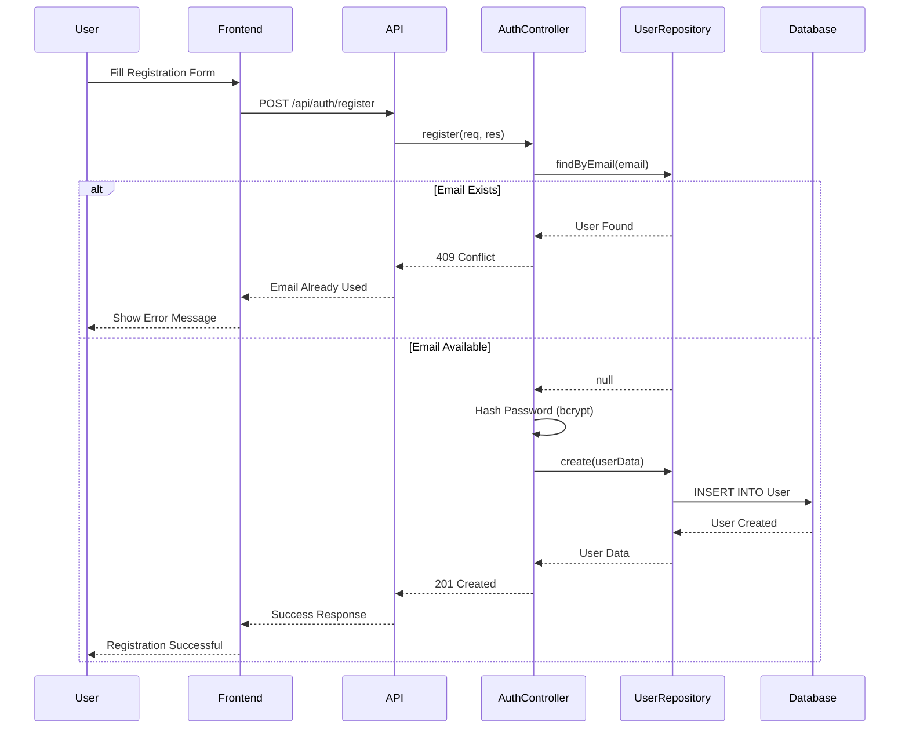

### 2. Booking Creation Workflow

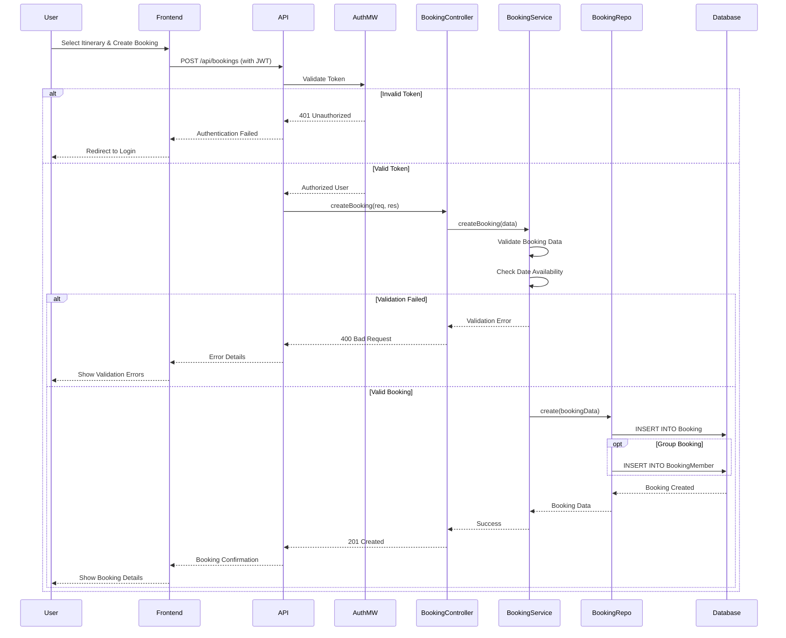

### 3. Itinerary Creation with Media Upload

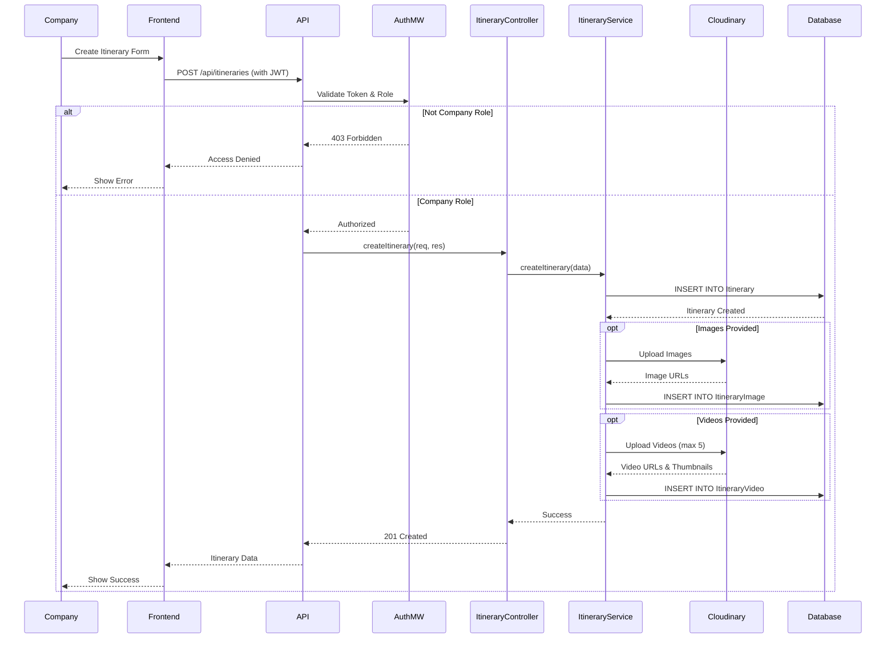

### 4. Rating Submission Workflow

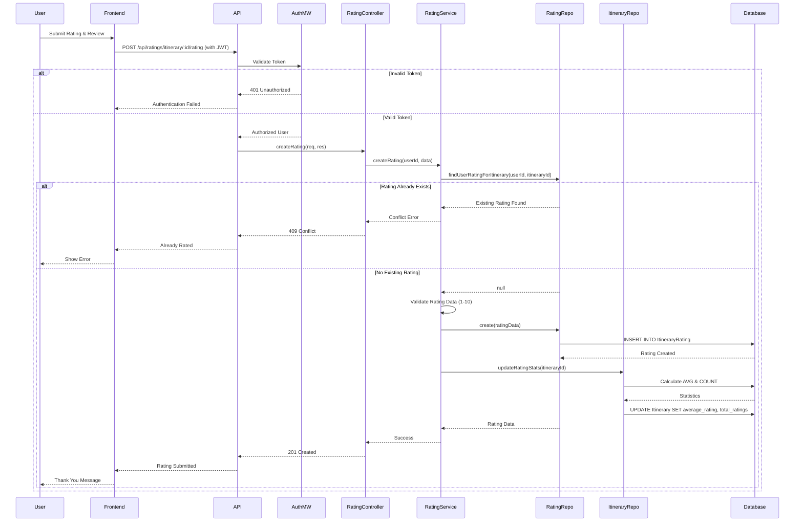
    participant Database
    
    Company->>Frontend: Create Itinerary Form
    Frontend->>API: POST /api/itineraries (with JWT)
    API->>AuthMW: Validate Token & Role
    
    alt Not Company Role
        AuthMW-->>API: 403 Forbidden
        API-->>Frontend: Access Denied
        Frontend-->>Company: Show Error
    else Company Role
        AuthMW-->>API: Authorized
        API->>ItineraryController: createItinerary(req, res)
        ItineraryController->>ItineraryService: createItinerary(data)
        ItineraryService->>Database: INSERT INTO Itinerary
        Database-->>ItineraryService: Itinerary Created
        
        opt Images Provided
            ItineraryService->>Cloudinary: Upload Images
            Cloudinary-->>ItineraryService: Image URLs
            ItineraryService->>Database: INSERT INTO ItineraryImage
        end
        
        ItineraryService-->>ItineraryController: Success
        ItineraryController-->>API: 201 Created
        API-->>Frontend: Itinerary Data
        Frontend-->>Company: Show Success
    end
```

## Layered Architecture Model

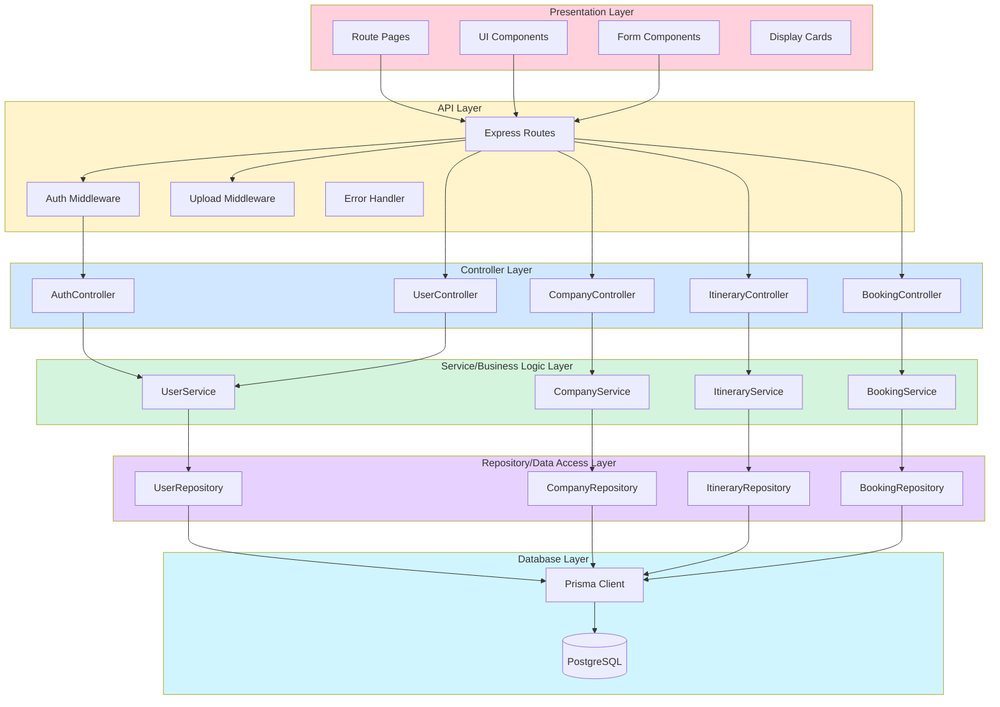

## MVC Pattern Implementation

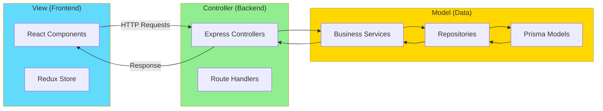

## Role-Based Access Control Model

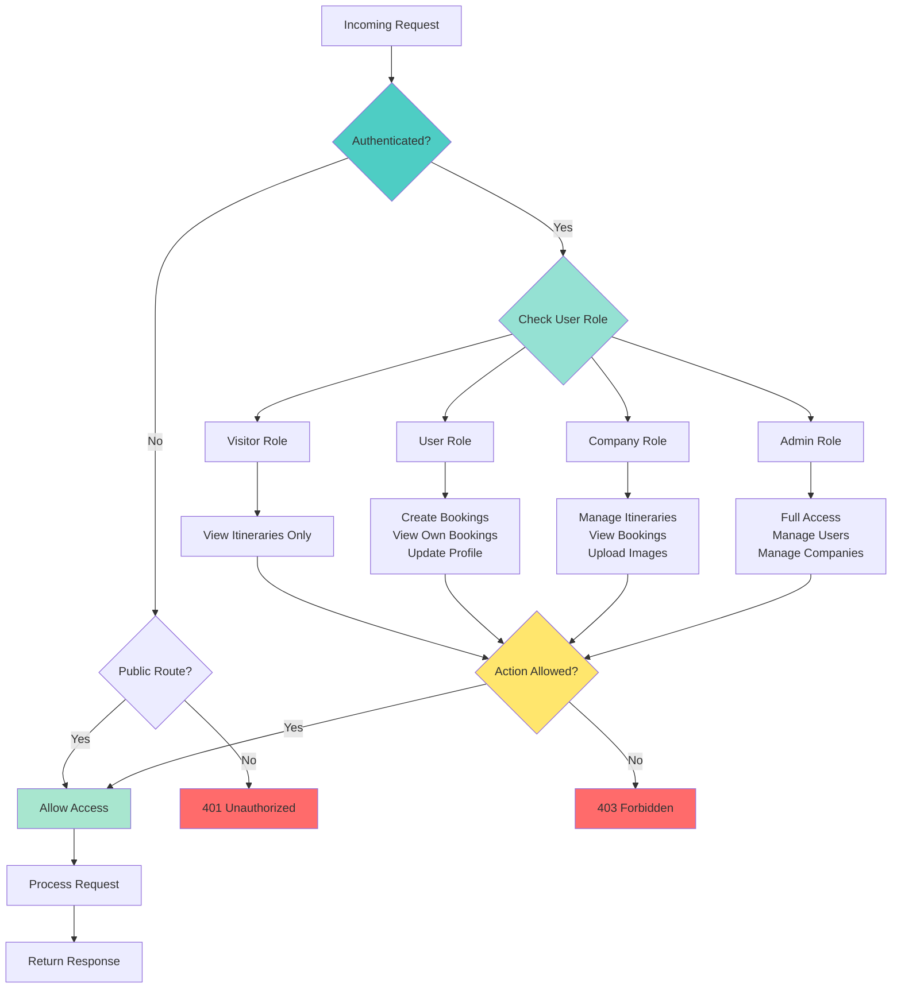

## Data Persistence Model

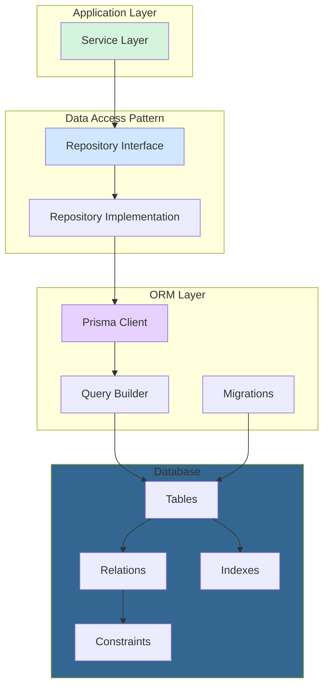

## Request-Response Cycle

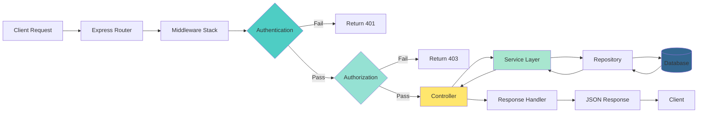

## Error Handling Model

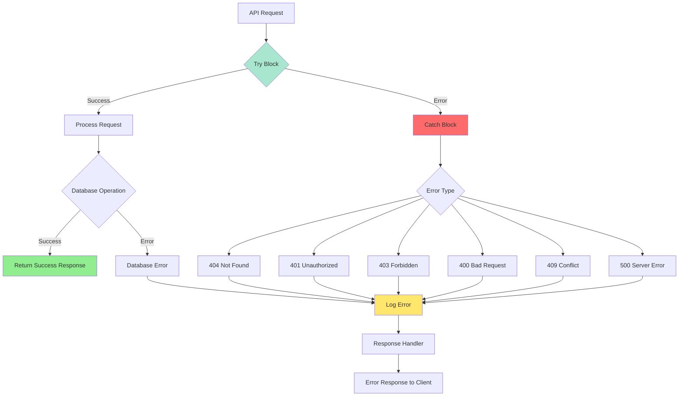

## State Management Model (Frontend)

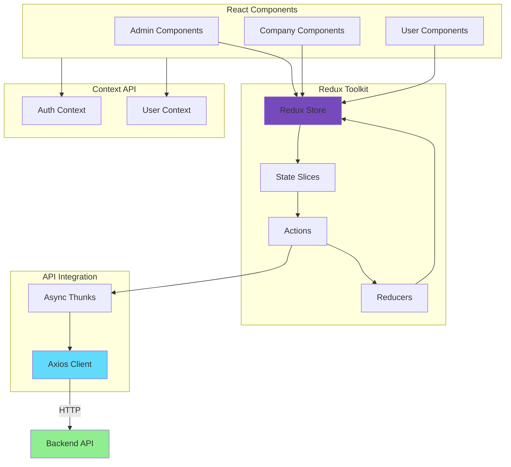

## Design Patterns Used

### Repository Pattern
- Abstracts data access logic
- Provides clean API for data operations
- Enables testing with mock repositories

### Service Layer Pattern
- Encapsulates business logic
- Coordinates multiple repositories
- Handles complex workflows

### Middleware Pattern
- Authentication verification
- Request logging
- Error handling
- File upload processing

### DTO Pattern
- Data transfer between layers
- Input validation
- Type safety

### Dependency Injection
- Services injected into controllers
- Repositories injected into services
- Promotes loose coupling

## Model Benefits

✅ **Separation of Concerns**: Clear boundaries between layers  
✅ **Scalability**: Easy to add new features without affecting existing code  
✅ **Testability**: Each layer can be tested independently  
✅ **Maintainability**: Code is organized and easy to understand  
✅ **Reusability**: Components and services can be reused  
✅ **Security**: Authentication and authorization at multiple levels  
✅ **Performance**: Optimized data access and caching strategies  

---

**Model Architecture**: Layered Architecture with MVC Pattern  
**Communication**: REST API with JSON  
**Authentication**: JWT Token-based  
**Database Access**: Repository Pattern with Prisma ORM  
**Last Updated**: March 29, 2026

