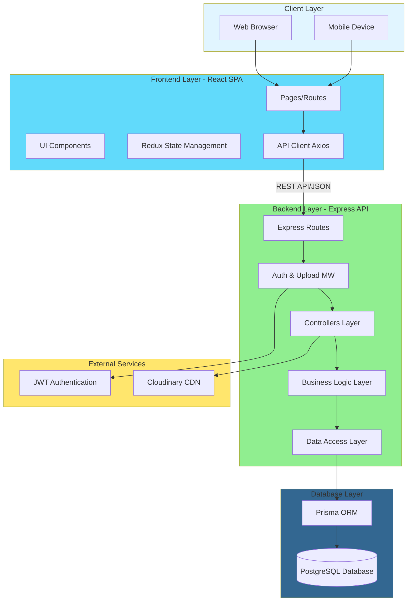
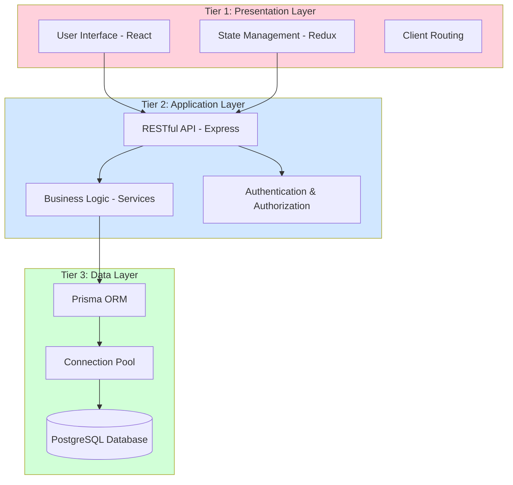
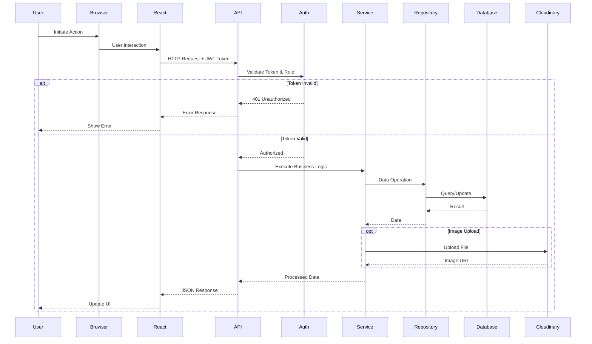
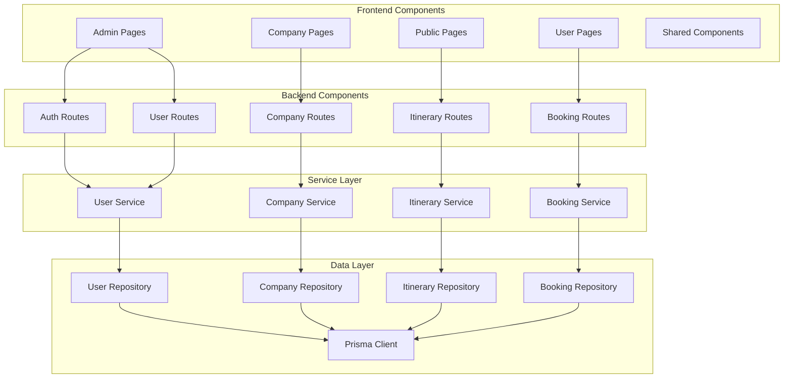
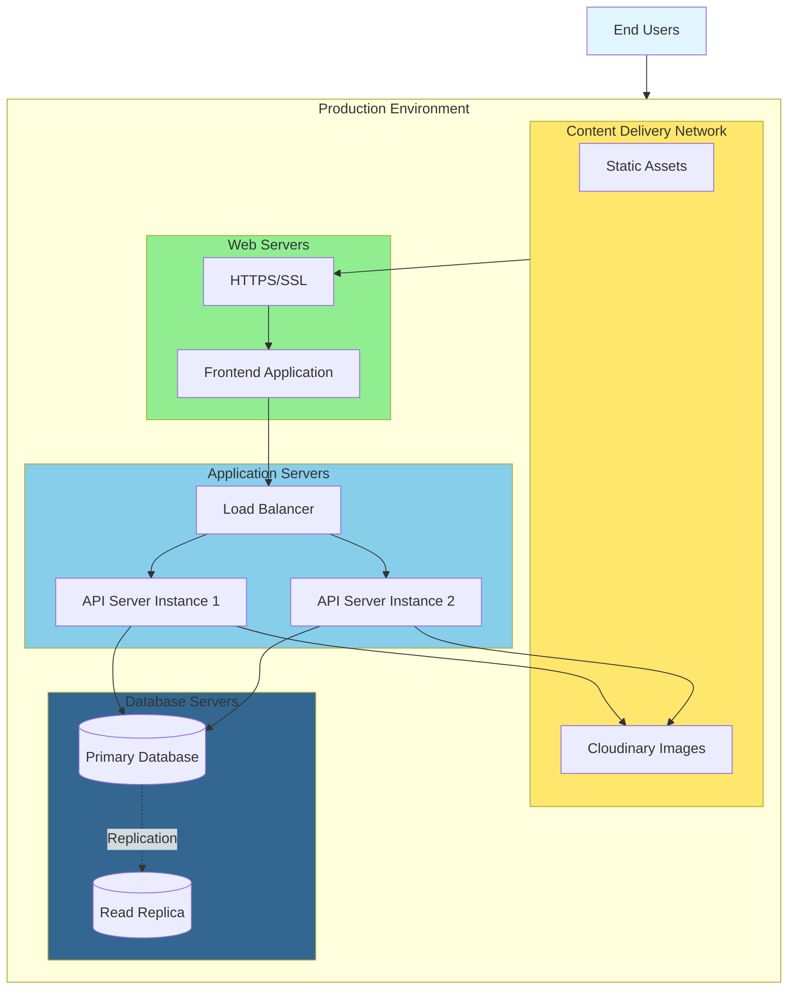
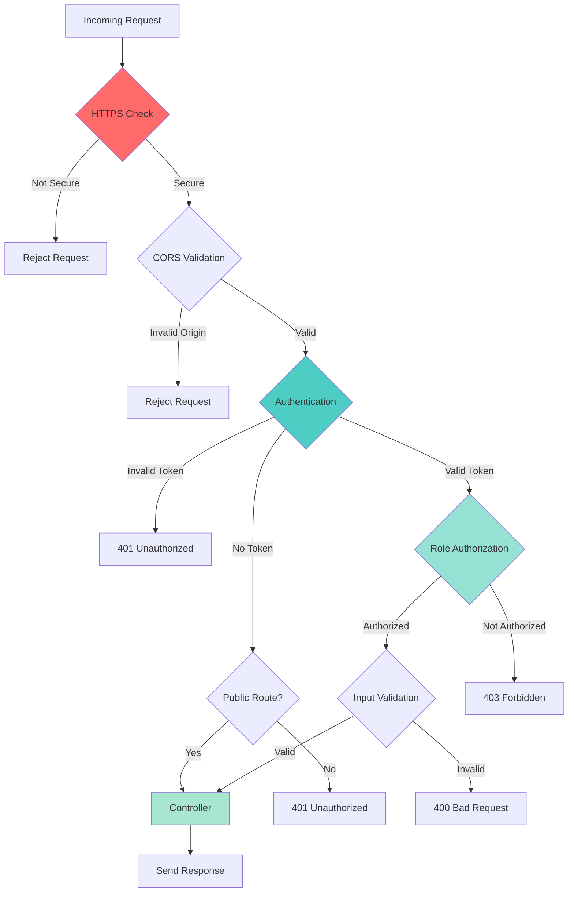

# System Architecture Diagram - TEMBERA Tourism Platform

## High-Level System Architecture

## Three-Tier Architecture

## Data Flow Architecture

## Component Architecture

## Deployment Architecture

## Security Architecture

## Technology Stack

| Layer | Technology | Purpose |
|-------|-----------|---------|
| **Frontend** | React 19 | UI Framework |
| | TypeScript | Type Safety |
| | Redux Toolkit | State Management |
| | Vite | Build Tool |
| | Tailwind CSS | Styling |
| **Backend** | Node.js | Runtime |
| | Express 5 | Web Framework |
| | TypeScript | Type Safety |
| | Prisma 7 | ORM |
| **Database** | PostgreSQL | Relational Database |
| **Storage** | Cloudinary | Image CDN |
| **Auth** | JWT | Token Authentication |
| | bcrypt | Password Hashing |

## Architecture Characteristics

### Scalability
- Horizontal scaling with stateless API
- Database connection pooling
- CDN for static content
- Load balancing capability

### Security
- HTTPS encryption
- JWT authentication
- Role-based access control
- Input validation & sanitization
- Password hashing with bcrypt

### Performance
- Optimized database queries
- Image optimization via CDN
- Frontend code splitting
- API response caching

### Reliability
- Error handling & logging
- Database transactions
- Graceful degradation
- Health monitoring

### Maintainability
- Modular architecture
- Type safety with TypeScript
- API documentation with Swagger
- Version-controlled migrations

---

**Architecture Style**: Layered Three-Tier Architecture  
**Communication Protocol**: REST over HTTPS  
**Data Format**: JSON  
**Last Updated**: March 29, 2026

