# Use Case Diagram - TEMBERA Tourism Platform

## Use Case Diagram (Mermaid)

```mermaid
graph TB
    subgraph "TEMBERA Tourism Platform"
        %% Visitor Use Cases
        UC1[Browse Itineraries]
        UC2[View Itinerary Details]
        UC3[Register Account]
        UC4[Login]
        
        %% User Use Cases
        UC5[Create Booking]
        UC6[Create Group Booking]
        UC7[View My Bookings]
        UC8[Cancel Booking]
        UC9[Update Profile]
        UC10[Add Booking Members]
        UC31[Rate Company]
        UC32[Rate Itinerary]
        UC33[Write Review]
        UC34[Update My Rating]
        UC35[Delete My Rating]
        UC36[View Rating Statistics]
        
        %% Company Use Cases
        UC11[Register Company]
        UC12[Create Itinerary]
        UC13[Update Itinerary]
        UC14[Delete Itinerary]
        UC15[Upload Itinerary Images]
        UC37[Upload Itinerary Videos]
        UC16[View Company Bookings]
        UC17[Manage Company Profile]
        UC18[View Booking Statistics]
        UC19[View Attendees]
        UC38[View Company Ratings]
        UC39[View Itinerary Ratings]
        
        %% Admin Use Cases
        UC20[Manage Users]
        UC21[Manage Companies]
        UC22[Create Company]
        UC23[View All Bookings]
        UC24[Manage Roles]
        UC25[View System Statistics]
        UC26[Approve/Suspend Companies]
        UC27[Delete Users]
        UC40[Moderate Ratings]
        UC41[View All Ratings]
        
        %% Shared Use Cases
        UC28[Logout]
        UC29[Search Itineraries]
        UC30[Filter by Location/Date/Price]
        UC42[View Ratings and Reviews]
    end
    
    %% Actors
    Visitor((Visitor))
    User((User/Tourist))
    Company((Company Owner))
    Admin((Administrator))
    
    %% Visitor Connections
    Visitor --> UC1
    Visitor --> UC2
    Visitor --> UC3
    Visitor --> UC4
    Visitor --> UC29
    Visitor --> UC30
    Visitor --> UC42
    
    %% User Connections
    User --> UC1
    User --> UC2
    User --> UC5
    User --> UC6
    User --> UC7
    User --> UC8
    User --> UC9
    User --> UC10
    User --> UC28
    User --> UC29
    User --> UC30
    User --> UC31
    User --> UC32
    User --> UC33
    User --> UC34
    User --> UC35
    User --> UC36
    User --> UC42
    
    %% Company Connections
    Company --> UC11
    Company --> UC12
    Company --> UC13
    Company --> UC14
    Company --> UC15
    Company --> UC37
    Company --> UC16
    Company --> UC17
    Company --> UC18
    Company --> UC19
    Company --> UC28
    Company --> UC1
    Company --> UC29
    Company --> UC38
    Company --> UC39
    Company --> UC42
    
    %% Admin Connections
    Admin --> UC20
    Admin --> UC21
    Admin --> UC22
    Admin --> UC23
    Admin --> UC24
    Admin --> UC25
    Admin --> UC26
    Admin --> UC27
    Admin --> UC28
    Admin --> UC1
    Admin --> UC29
    Admin --> UC40
    Admin --> UC41
    Admin --> UC42
    
    %% Relationships
    UC6 -.->|includes| UC10
    UC5 -.->|extends| UC6
    UC12 -.->|includes| UC15
    UC22 -.->|extends| UC21
    UC26 -.->|extends| UC21
    UC3 -.->|leads to| UC4
    UC4 -.->|authenticates| UC5
    
    style Visitor fill:#e1f5ff
    style User fill:#c3e6cb
    style Company fill:#fff3cd
    style Admin fill:#f8d7da
```

## Use Case Descriptions

### Visitor Use Cases

| Use Case ID | Use Case Name | Description |
|------------|---------------|-------------|
| UC1 | Browse Itineraries | View all available travel itineraries without authentication |
| UC2 | View Itinerary Details | See detailed information about a specific itinerary including images, price, location |
| UC3 | Register Account | Create a new user account with name, email, password, and phone |
| UC4 | Login | Authenticate using email and password |
| UC29 | Search Itineraries | Search for itineraries by keywords |
| UC30 | Filter Itineraries | Filter itineraries by location, date, or price range |

### User/Tourist Use Cases

| Use Case ID | Use Case Name | Description |
|------------|---------------|-------------|
| UC5 | Create Booking | Book a personal itinerary for a specific date |
| UC6 | Create Group Booking | Book an itinerary for multiple people |
| UC7 | View My Bookings | See all personal bookings and their status |
| UC8 | Cancel Booking | Cancel an existing booking |
| UC9 | Update Profile | Modify user profile information |
| UC10 | Add Booking Members | Add member details to a group booking |
| UC31 | Rate Company | Provide a rating (1-10) for a tour company |
| UC32 | Rate Itinerary | Provide a rating (1-10) for an itinerary experience |
| UC33 | Write Review | Add detailed text feedback with ratings |
| UC34 | Update My Rating | Modify previously submitted ratings |
| UC35 | Delete My Rating | Remove own rating from the system |
| UC36 | View Rating Statistics | See average ratings and distributions |
| UC28 | Logout | End the current session |

### Company Owner Use Cases

| Use Case ID | Use Case Name | Description |
|------------|---------------|-------------|
| UC11 | Register Company | Create a company profile on the platform |
| UC12 | Create Itinerary | Add a new travel itinerary with comprehensive details |
| UC13 | Update Itinerary | Modify existing itinerary information |
| UC14 | Delete Itinerary | Remove an itinerary from the platform |
| UC15 | Upload Itinerary Images | Add multiple images to showcase an itinerary |
| UC37 | Upload Itinerary Videos | Add up to 5 videos per itinerary |
| UC16 | View Company Bookings | See all bookings for company itineraries |
| UC17 | Manage Company Profile | Update enhanced company information (logo, tagline, social media, etc.) |
| UC18 | View Booking Statistics | See analytics and booking trends |
| UC19 | View Attendees | See list of people who booked company itineraries |
| UC38 | View Company Ratings | See all ratings and reviews for the company |
| UC39 | View Itinerary Ratings | See ratings and feedback for specific itineraries |

### Administrator Use Cases

| Use Case ID | Use Case Name | Description |
|------------|---------------|-------------|
| UC20 | Manage Users | View, update, or delete user accounts |
| UC21 | Manage Companies | Oversee all companies on the platform |
| UC22 | Create Company | Add new company on behalf of an owner |
| UC23 | View All Bookings | See all bookings across the platform |
| UC24 | Manage Roles | Assign or modify user roles and access levels |
| UC25 | View System Statistics | Access platform-wide analytics including rating statistics |
| UC26 | Approve/Suspend Companies | Control company access status |
| UC27 | Delete Users | Remove user accounts from the system |
| UC40 | Moderate Ratings | Remove inappropriate or spam ratings |
| UC41 | View All Ratings | See all ratings across companies and itineraries |

### Shared Use Cases

| Use Case ID | Use Case Name | Description |
|------------|---------------|-------------|
| UC42 | View Ratings and Reviews | Browse ratings, reviews, and statistics for companies and itineraries |

## Actor Descriptions

| Actor | Description | Privileges |
|-------|-------------|------------|
| **Visitor** | Unauthenticated user browsing the platform | Read-only access to public itineraries |
| **User/Tourist** | Registered user who can book itineraries | Can create bookings, manage profile |
| **Company Owner** | Business owner offering tourism services | Can create/manage itineraries and view bookings |
| **Administrator** | Platform manager with full access | Full CRUD operations on all entities |

## Use Case Relationships

- **Include**: A use case always includes another (e.g., Group Booking includes Add Booking Members)
- **Extend**: A use case optionally extends another (e.g., Personal Booking can be extended to Group Booking)
- **Generalization**: Inheritance relationship between actors or use cases

---

**Note**: This diagram represents the main use cases of the TEMBERA platform. Some administrative and edge case scenarios may not be shown for clarity.

